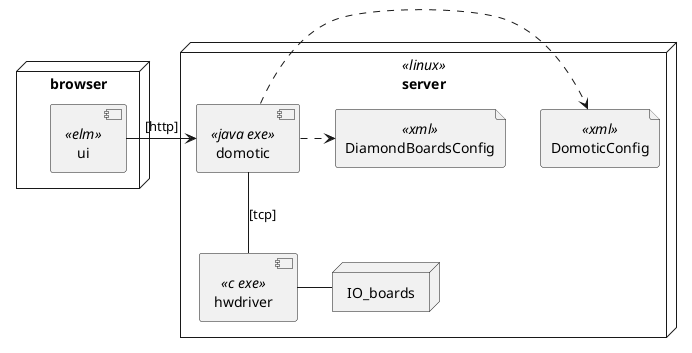
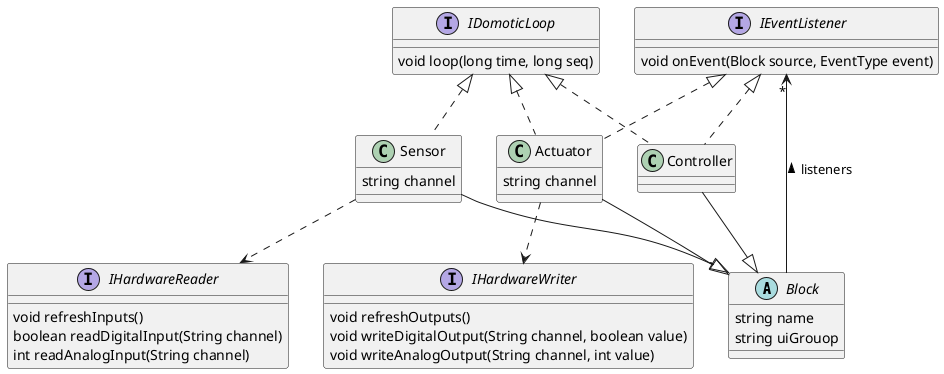

# Design

## Architectural Drivers

This lists these home automation requirements that drive the design.

1. Layout Configurability: Easy to configure when sensors or actuators are added, removed or changed. For example, assigning a switch to another lamp, changing name of a lamp, change the sun sensitivity for automatic screens, change when lights outside go on and off automatically.
2. UI Configurability: A UI that is generated from the configuration. So no coding work whenever the configuration (see 1) changes.
3. Reliable: Since I'm sometimes traveling and my wife or children lack knowledge on the system, it must have no bugs.
4. Safe: hardware like screenmotors must never get signals that make them break.
5. Available: 99,99% uptime over 1 week, so 1.01 minutes a week. 
6. HW Change: other hardware could be chosen than the current one, and that should have no or very little (max. 1 man-week work) impact.
7. A test-bed for new software technologies and a showcase. So some degree of over-engineering is allowed ;-)

The next chapters describe different views of the archictectural design that explain the structure of the system.
The final chapter will use these views to explain how the above architectural requirements (drivers) are realized.

-----------

## Deployment View



Description of the different nodes and components:

|element | description |
|---|---|
| server | Ubuntu Linux on an Advantech Atom PC, with PC/104 connectors. |
| IO boards | Diamond System Corporation PC/104 compatible boards. These connect to lamps, screens, switches, dimmers etc. |
| browser | Any browser on the local network, so `192.168.*.*`. |
| hwdriver | Program that runs in supervisor mode so that it can talk to the IO boards. |
| domotic | Java program that contains all the logic of the domotic system. It has an embedded Jetty HTTP server. |
| ui | ELM based GUI as an alternative to mechanical switches. |
| DomoticConfig | Defines all inputs, outputs and behaviours of the home automation system. Switches, Lamps, Screens etc., and how the are connected and configured.<br/>It also defines the layout in the UI.|
| DiamondBoardsConfig | Defines how the hardware is configured. See Layered View later, this allows for different hardware to be used without touching the domotic specific code. |

The protocols are as follows:
| protocol | description |
|---|---|
| http | Simple http, so no security, so local network only. |
| tcp | TCP based interaction protocol between domotic and hwdriver. Protocol is self designed, but simple. |

The corresponding files are:
|element | filename | 
|---|---| 
| domotic | domotica-1.0-jar-with-dependencies.jar (ignore the 1.0) | 
| DomoticConfig | DomoticConfig.xml |
| DiamondBoardsConfig | DiamondBoardsConfig.xml |
| ui | domotic.js, index.html |
| hwdriver | hwdriver |

Not described here are the Linux service definition and health check. See [deployment](./deployment/README.md) subfolder for more information.


## Class View

The main classes of the system are depicted below.



|class | description |
|---|---|
| Block | Supertype that just has a unique name and information for the UI (1). |
| Sensor | Sensors sense input from hardware. They have at least one input channel, sometimes more. They transform simple hardware inputs into higher level events, such as DoubleClick or SingleClick or WindHigh.<br/> Only Sensors can read data from hardware. <br/>Sensors send events to Controllers or directly to Actuators.| 
| Actuator | Actuators actuate output. They have at least one output channel like a switch, or multiple like up/down for screens. <br/>Only Actuators can change outputs of hardware. <br/> Actuators do not send events to other Blocks.
| Controller | Controller typically contain functionally complex logic.<br/>Controllers have no access to hardware.<br/>Controllers send events to  Actuators or other Controllers. |
| IDomoticLoop | All Blocks implement the `loop()` function called from `loopOnce()` described later. State changes of a Block, like 'on' or 'off' in an Actuator, must only occur from within a `loop()` function (not from an event). |
| IEventListener | Blocks can send events to other Blocks, e.g. when a switch is pressed (Sensor) a lamp is switched on (Actuator). For safety event propagation is limited (see previous rows, from Sensor to Controller (optional) to Actuator, never reverse) and state changes can only happen in `loop()`|
| IHardwareReader IHardwareWriter | Sensors and Actuators respectively read from and write to the hardware via an implementation of this interface. This abstracts away the actual hardware used.|

(1) The UI is completely dynamic, as it is built up from information in the configuration files. So no programming required when domotic configuration changes.

Below code is the core driver of the domotic system.

```java
	public synchronized void loopOnce(long currentTime) {
		hw.refreshInputs();
		for (Sensor s : sensors) {
			s.loop(currentTime);
		}
		for (Controller c : controllers) {
			c.loop(currentTime);
		}
		for (Actuator a : actuators) {
			a.loop(currentTime);
		}
		hw.refreshOutputs();

        for (IStateChangedListener uiUpdator : stateChangeListeners)
            uiUpdator.updateUi();
	}

```

This is what happens every 20 ms (configurable):

- `IHardwareIO.refreshInputs()` is called, so that actual hardware inputs are read.
- All Sensors have their `Sensor.loop()` run to process these inputs and update any state machines. State changes may lead to events being sent to Controllers or Actuators that are registered in the Sensor. These Controllers and Actuators must not yet change their state or send events themselves - they just have to 'remember' the event received.
- Next `Controller.loop()` is run on all Controllers. Now it is the time to process any event information received and noted before, in the `loop()`. This may lead to a state change of the Controller, which in turn may lead to an event to another Controller or Actuator - which again just notes the information down sent by the event.
- Finally Actuators have their `Actuator.loop()` executed, so they can update state and if applicable update hardware outputs. To actually update hardware output `IHardwareIO.refreshOutputs()` is called.
- Finally any `IStateChangedListener`'s are called to update the modelstate of connected client UIs. _This is for UI only, not further explained in this document._

The `currentTime` is a parameter passed on to each Block's `loop()` - it is forbidden in any Block to use `System.currentTimeMillis()` to get actual time. The reason for this is automated testing: the time is a parameter that can be manipulated at will, including in testing or - later - replay.

The separation of event notification and handling its' state changes in `loop()` ensures orderly execution of changes in that outputs are only changed when all sensor and intermediate logic has executed. It also helps the time simulation. 

Safety is further improved by separating hardware access for Sensor, Controller and Actuator, and the fact that Sensors cannot be the target of events.

## Layers View

There are 4 major parts:
1. UI
2. eu.dlvm.domotics: namespace of all Java classes that are independent of the hardware, and contains all functional logic; this also has the `main()` routine
3. eu.dlmv.iohardware: namespace of hardware specific classes, abstracted away behind `IHardwareIO` interface described earlier.
4. hwdriver is a small C executable

Note that parts 2 and 3 are inside one Java executable (.jar file).

```plantuml
package ui <<elm>> {

}
package domotic <<java exe>> {
    interface RestAPI
    ui -> RestAPI : HTTP
    package eu.dlvm.domotics {
        file DomoticConfig <<xml>>   
    }
    RestAPI <|. eu.dlvm.domotics
    interface IHardwareIO
    package eu.dlvm.iohardware {
        file DiamondBoardsConfig <<xml>>

    }
    eu.dlvm.domotics --> IHardwareIO
    IHardwareIO <|.. eu.dlvm.iohardware
}
package hwdriver <<c exe>>{

}

eu.dlvm.iohardware -> hwdriver : TCP


```

-----------

## Architectural Evaluation

So how does this design realizes the architectural requirements listed in the beginning of this document?

| Driver | Evaluation |
| --- | --- |
| Layout Configurability | The DomoticConfig XML file fully describes the layout, and is processed at re-start. See Deployment View and Layering View. |
| UI Configurability | The DomoticConfig XML file includes the UI configuration. _Not yet described in design._ |
| Reliable | Fully automated regression tests are provided. The ability to simulate time is fundamental here.<br/>Also a sound approach to how events are handled and state changes are separated from the events is fundamental. These concepts are explained in Class View.|
| Safe | Only Actuators can change outputs so the issues is localized in specific code, improving safety by not scattering this functionality around. Further state changes are localized in Actuator's `loop()` and outputs must only change as a consequence of a state change, further localizing this functionality. Lastly in the Actuator's `loop()` a safeguard must be implemented ensuring that an output does not change too often, e.g. max 1 time per second.|
| Available |The domotic and hwdriver processes run as a service, have a health check and a cron job restarts when no heartbeat is detected (not yet described in any view). Also automated tests contribute here.  |
| HW Change | See Layering View. |

