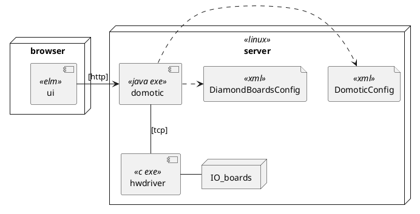
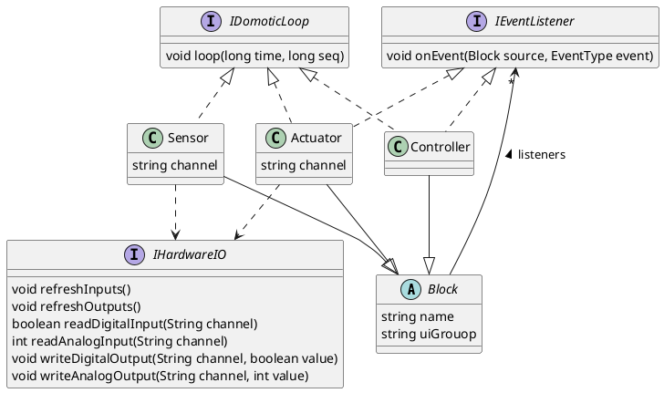

# Design

## Deployment View



Description of the different nodes and components:

|element | description |
|---|---|
| server | Ubuntu Linux on an Advantech Atom PC, with PC/104 connectors. |
| IO boards | Diamond System Corporation PC/104 compatible boards. These connect to lamps, screens, switches, dimmers etc. |
| browser | Any browser on the local network, so `192.168.*.*`. |
| hwdriver | Program that runs in supervisor mode so that it can talk to the IO boards. |
| domotic | Java program that contains all the logic of the domotic system. It has an embedded Jetty HTTP server. |
| ui | ELM based GUI as an alternative to mechanical switches. |
| DomoticConfig | Defines all inputs, outputs and behaviours of the home automation system. Switches, Lamps, Screens etc., and how the are connected and configured.<br/>It also defines the layout in the UI.|
| DiamondBoardsConfig | Defines how the hardware is configured. See Layered View later, this allows for different hardware to be used without touching the domotic specific code. |

The protocols are as follows:
| protocol | description |
|---|---|
| http | Simple http, so no security, so local network only. |
| tcp | TCP based interaction protocol between domotic and hwdriver. Protocol is self designed, but simple. |

The corresponding files are:
|element | filename | 
|---|---| 
| domotic | domotica-1.0-jar-with-dependencies.jar (ignore the 1.0) | 
| DomoticConfig | DomoticConfig.xml |
| DiamondBoardsConfig | DiamondBoardsConfig.xml |
| ui | domotic.js, index.html |
| hwdriver | hwdriver |

Not described here are the Linux service definition and health check. See [deployment](./deployment/README.md) subfolder for more information.


## Class View

The main classes of the system are depicted below.



|class | description |
|---|---|
| Block | Supertype that just has a unique name and information for the UI (1). |
| Sensor | Sensors sense input from hardware. They have at least one input channel, sometimes more. They transform simple hardware inputs into higher level events, such as DoubleClick or SingleClick or WindHigh.<br/> Only Sensors can read data from hardware. <br/>Sensors send events to Controllers or directly to Actuators.| 
| Actuator | Actuators actuate output. They have at least one output channel like a switch, or multiple like up/down for screens. <br/>Only Actuators change outputs of hardware. <br/> Actuators do not send events to other Blocks.
| Controller | Controller typically contain functionally complex logic.<br/>Controllers have no access to hardware.<br/>Controllers send events to  Actuators or other Controllers. |
| IDomoticLoop | All Blocks implement the `loop()` function called from `loopOnce()` described later. State changes of a Block, like 'on' or 'off' in an Actuator, must only occur from within a `loop()` function (not from an event). |
| IEventListener | Blocks can send events to other Blocks, e.g. when a switch is pressed (Sensor) a lamp is switched on (Actuator). For safety event propagation is limited (see previous rows, from Sensor to Controller (optional) to Actuator, never reverse) and state changes can only happen in `loop()`|
| IHardwareIO | Sensors and Actuators talk to the hardware via an implementation of this interface. This abstracts away the actual hardware used.|

(1) The UI is completely dynamic, as it is built up from information in the configuration files. So no programming required when domotic configuration changes.

Below code is the core driver of the domotic system.

```java
	public synchronized void loopOnce(long currentTime) {
		loopSequence++;
		hw.refreshInputs();
		for (Sensor s : sensors) {
			s.loop(currentTime, loopSequence);
		}
		for (Controller c : controllers) {
			c.loop(currentTime, loopSequence);
		}
		for (Actuator a : actuators) {
			a.loop(currentTime, loopSequence);
		}
		hw.refreshOutputs();

        if (loopSequence % 10 == 0) {
            for (IStateChangedListener uiUpdator : stateChangeListeners)
                uiUpdator.updateUi();
	}

```

This is what happens every 20 ms (configurable):

- `IHardwareIO.refreshInputs()` is called, so that actual hardware inputs are read.
- All Sensors have their `Sensor.loop()` run to process these inputs and update any state machines. State changes may lead to events being sent to Controllers, which are just registered there.
- Next `Controller.loop()` is run on all Controllers. Some data might have changed, which may update state of the Controller, and which might send events to other Controllers or Actuators. Again these events are noted by the event targets, not yet processed.
- Finally Actuators have their `Actuator.loop()` executed, so they can update state and if applicable update hardware outputs. To actually update hardware output `IHardwareIO.refreshOutputs()` is called.
- Finally any `IStateChangedListener`'s are called to update the modelstate of connected client UIs. _This is for UI only, not further explained in this document._

The `currentTime` is a parameter - it is forbidden in any Block to use `System.currentTimeMillis()` to get actual time. The reason for this is automated testing: the time is a parameter that can be manipulated at will, including in testing or - later - replay.

_**TODO** not sure it is still used, isn't this handled differently now, see higher?_ The `loopSequence` is used to detect and prevent infinite loops. Using events and badly written code it can happen that code calls itself infinitely. This can be catastrophic for the hardware (e.g. screens). 

## Layers View

There are 4 major parts:
1. UI
2. eu.dlvm.domotics: namespace of all Java classes that are independent of the hardware, and contains all functional logic; this also has the `main()` routine
3. eu.dlmv.iohardware: namespace of hardware specific classes, abstracted away behind `IHardwareIO` interface described earlier.
4. hwdriver is a small C executable

Note that parts 2 and 3 are inside one Java executable (.jar file).

```plantuml
package ui <<elm>> {

}
package domotic <<java exe>> {
    interface RestAPI
    ui -> RestAPI : HTTP
    package eu.dlvm.domotics {
        file DomoticConfig <<xml>>   
    }
    RestAPI <|. eu.dlvm.domotics
    interface IHardwareIO
    package eu.dlvm.iohardware {
        file DiamondBoardsConfig <<xml>>

    }
    eu.dlvm.domotics --> IHardwareIO
    IHardwareIO <|.. eu.dlvm.iohardware
}
package hwdriver <<c exe>>{

}

eu.dlvm.iohardware -> hwdriver : TCP


```