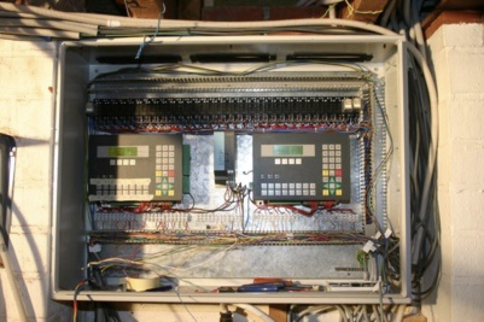
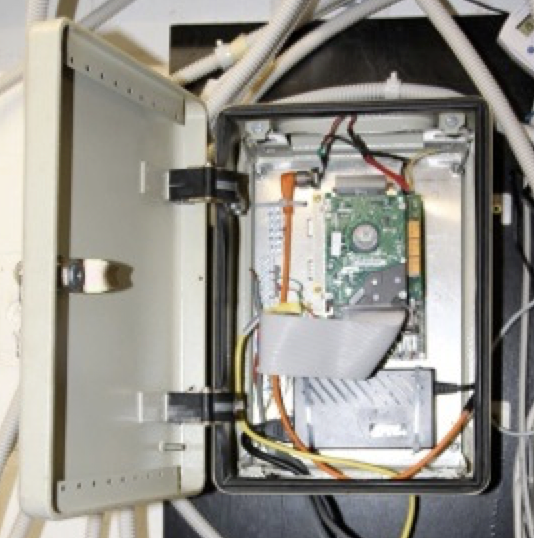

# History

## v1 2005 - Siemens PLC

PLC based solution, built by my brother in law Willem and my father - I was too busy in the major refactoring of our house. 

Worked very well. But changing stuff - e.g. change the speed of dimming - was too difficult. So I decided for a complete different approach.

## v2 2010-2013 - Simple hardware & Java

Since PLC programming was too cumbersome I decided to build and program a complete new home automation system with easy-to-get hardware. And I had had a management job at the time, I really missed programming.

First version was a proof of concept and only controlled one dimmer and one light. It used old hardware I got from Willem, using Linux - my son had to try lots of versions before there was one that worked. The software was written in mostly Java and a little C.

After a few months of flawless operation this gave the confidence to go full throttle.

So I bought an Advantech Atom processor and DMMAT I/O boards, and another I/O board I soldered myself to cut costs. Again using Linux, Java and C. The result - thanks to my father for the construction - is this small tower.

The complete system was installed and operational on August 25 2013, finally replacing the PLC version. 

It was time, my wife was fed up with me spending so much time on this...

## v3 2013-2018 - Web UI

Addition of a Web UI, written in the extremely interesting language [elm](https://elm-lang.org), suggested to me around 2012 by Frank Piessens. It is a subset of Haskell, pure functional, strongly typed and reactive. It transpiles into Javascript. It got me really interested in functional programming.

Also wind- and sun sensors were implemented, and websockets to have a nice graph in the UI of the current wind and sun.

## FUTURE v4 2021 - React, Streaming and AWS

To keep my skills up to date v4 will be about:
- rewrite front end in React and Javascript
- use Kafka to stream events between hw-driver, domotic, ui-server and analytics (e.g. electricity consumption, gas pricess going up!)
- put the ui-server in aws so we can have strong authentication for the UI, and global access