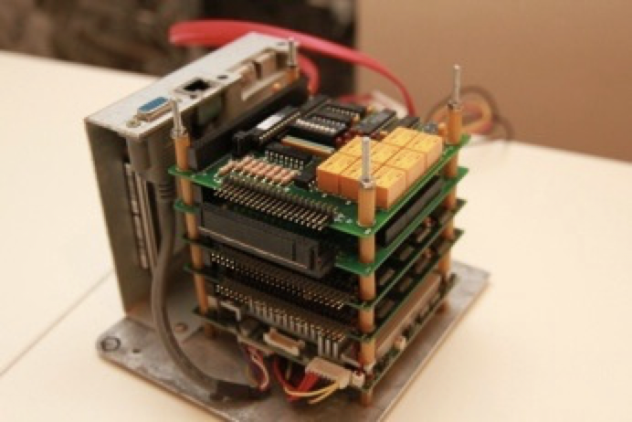

# DIY home automation

## Contact & Licensing
- Author: Dirk Vaneynde
- Contact: dirk@dlvmechanografie.eu
- License: [MIT License](./LICENSE.txt)

## Overview

Home automation system built up from common hardware. 

> **Caution:** It only handles lights and sun screens, not wall sockets or heating or other fancy stuff. 

The primary goal of this system is for me, as a software engineer, to keep my skills up to date, have some fun and sometimes help convince recruiters to hire me ;-) There are much more feature rich open-source systems available elsewhere.

Here is a view of the hardware I currently use.

Basically it uses Advantech and Diamond hardware with digital and analog inputs and outputs, connected to switches, lamps, voltage controlled dimmers or a weather station that measures wind and light.

There are two inputs: the common switches and an [elm](https://elm-lang.org) based UI.

More details are in [Design](./DESIGN.md), and some historical evolutions (and more photos) are in [History](./HISTORY.md).

## Projects

Each project is in a sub-folder, with its own README:

1. [domotic](./domoti/../../README.md) : the main program, java based
2. [hwdriver](./hwdriver/dscud5/README.txt) : the C program talking to the hardware
3. [elm-ui](./elm-ui/README.md) : the web UI
4. [deployment](deployment/install/instructions.txt) : automated deployment and also first time setup
5. azimuth : library to calculated azimuth, scala based

## Build and Deploy

See [Deployment](./deployment/README.md).