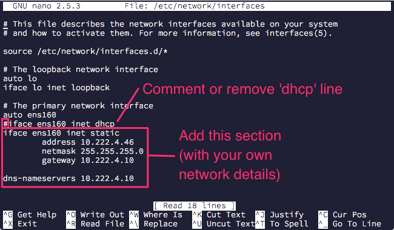

# First Time Setup

## Hardware
- 32 bit !
- Intel(R) Atom(TM) CPU N450   @ 1.66GHz

## Install Ubuntu

Ubuntu 16.04.1 LTS, 32 bit, Server
- Zie /Users/dirk/Documents/projecten/domotica2/2 os en tools

Creëer usb stick.
https://ubuntu.com/tutorials/create-a-usb-stick-on-macos#1-overview

## SSH server

1. Open your terminal application
2. Install the openssh-server package on Ubuntu, run: `sudo apt install openssh-server`
3. Enable ssh server on Ubuntu, run: `sudo systemctl enable ssh`
4. By default, firewall will block ssh access. Therefore, you must enable ufw and open ssh port. Open ssh tcp port 22 using ufw firewall, run: `sudo ufw allow ssh`

Congratulations. Now you have SSH server installed and running on your Ubuntu server. You can connect to it using ssh client.


## Fix IP
https://michael.mckinnon.id.au/2016/05/05/configuring-ubuntu-16-04-static-ip-address/ 

`sudo vi /etc/network/interfaces`
 


```
iface <interface> inet static
	address 192.168.0.100
	netmask 255.255.255.0
	gateway 192.168.0.1SH authenticatie configureren
dns-nameservers 8.8.8.8 8.8.4.4
```

`sudo reboot`


## SSH authentication
See https://lani78.com/2008/08/08/generate-a-ssh-key-and-disable-password-authentication-on-ubuntu-server/

```bash
scp id_rsa.home.pub dirk@$192.168.0.10:
ssh dirk@192.168.0.10
mkdir .ssh
chmod 700 .ssh
cat id_rsa.home.pub >>.ssh/authorized_keys
rm id_rsa.home.pub
```

See article on how to disable password login.

## Java, GCC & Make

```bash
sudo apt-get install default-jdk
java -version
# Should be 1.8 openJdk

sudo apt install gcc
# gcc should be version 5.4.0 (of later)

# install make
sudo apt-get install build-essential
```

## dscud5

See /Users/dirk/Documents/projecten/domotica2/3 software
Copy tar to /usr/local and expand.

## Install software first time

On development machine run `install/install.sh` - should install everything on domotic system.

Next prepare for web-app

```bash
# create directory /home/dirk/domotic/static on domotica machine, then:
scp static/index.html domotica3:/home/dirk/domotic/static
```

## Set up Services & Health

See `scripts` folder, these scripts must be installed on the Ubuntu server.

- `domotic.sh` : copy into /etc/init.d/domotic.sh
- `watchdog.sh` : copy into ~/domotic

Then:
```bash
/etc/init.d/domotic.sh start
```

Check files domotic.pid abd boot.out in `/home/dirk/domotic`.

Ensure startup at boot time:

``` bash
sudo update-rc.d domotic.sh defaults	# startup at boot time
ls -l /etc/rc?.d/*domo*				# check
```

`watchdog.sh` will check domotic.pid, and if process is not there but domotic.pid is, it will restart via 'domotic.sh restart'. For this to work you need to define a cron job.

```bash
$ sudo crontab -u root -e
# m h  dom mon dow   command
# Every minute run watchdog for domotic
* * * * *	/home/dirk/domotic/watchdog.sh >/home/dirk/domotic/cron.out

$ sudo crontab -l
```
